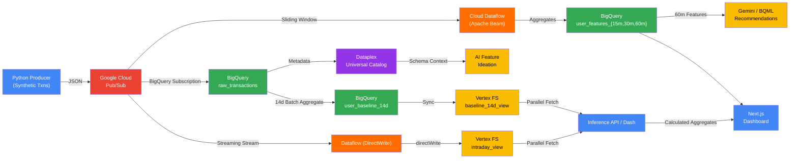

# AML Real-Time Feature Engineering & AI Recommendations Demo

## Architecture



## Quick Start

### Prerequisites
- Google Cloud project with billing enabled
- `gcloud` CLI installed and authenticated
- Python 3.9+

### 1. Configure Environment
```bash
cp .env.example .env
# Edit .env with your GCP project details
```

### 2. Run Checkpoints in Order

| # | What | Command |
|---|------|---------|
| **CP0** | Setup environment | `pip install -r requirements.txt` |
| **CP1** | Create Pub/Sub Topic | `bash execution/01_setup_pubsub.sh` |
| **CP1** | Start producer | `python execution/01_pubsub_producer.py` |
| **CP2** | Create BQ tables | Copy `execution/02_bq_table_setup.sql` → BQ Console |
| **CP2** | Setup Pub/Sub→BQ | (Included in CP1) |
| **CP3** | Start Dataflow Pipeline | `python execution/03_dataflow_pipeline.py --runner=DirectRunner` |
| **CP4** | Setup BQ↔Vertex AI | `bash execution/04_setup_bq_connection.sh` |
| **CP4** | Create Gemini model | Copy `execution/04_remote_model.sql` → BQ Console |
| **CP4** | Generate recommendations | Copy `execution/04_recommendations.sql` → BQ Console |
| **CP4** | Feature ideation | Copy `execution/04_feature_ideation.sql` → BQ Console |
| **CP5** | Setup Dataplex | `bash execution/05_dataplex_setup.sh` |
| **CP5** | Query metadata | Copy `execution/05_dataplex_metadata.sql` → BQ Console |
| **CP6** | Continuous Queries Alerts| Copy `execution/06_continuous_queries.sql` → BQ Console |
| **CP7** | Deploy Dataform | Upload `dataform/` to Dataform repository |
| **CP8** | Conversational Agent | See `execution/07_conversational_agent.sql` |
| **CP8b** | 14-Day Batch Baseline | Copy `execution/08_batch_baseline.sql` → BQ Console |
| **CP9** | Provision Feature Store | `python execution/08_vertex_fs_setup_rest.py` |
| **CP9** | Start DirectWrite Stream | `python execution/09_dataflow_directwrite.py` |
| **CP10** | Start Inference API | `uvicorn execution.10_inference_api:app --port 8080` |
## Dashboard & UI

This project includes a Next.js frontend dashboard to visualize the real-time feature engineering and AI recommendations.

### Getting Started / Initiating the Application

First, ensure your environment variables are configured as per the prerequisites.
Then, navigate to the dashboard directory and run the development server:

```bash
cd dashboard
npm install
npm run dev
```

Open [http://localhost:3000](http://localhost:3000) with your browser to view the dashboard.

### Simulation Control Behavior

The dashboard includes a **"Simulate" button** to generate synthetic transactions. 
* **What it does:** The simulate button **only** starts the producer script (`01_pubsub_producer.py`) which publishes synthetic transactions to Pub/Sub. 
* **What it does NOT do:** It does **not** automatically start the Dataflow Direct-Runner job. You must start the Direct-Runner explicitly in your terminal to process the messages:
  
  ```bash
  python execution/03_dataflow_pipeline.py --runner=DirectRunner
  ```

### Runtime Feature Calculation & AI

* **Features:** Transaction features (e.g., `tx_count`, `total_spend`, `avg_amount`, `max_amount`) are calculated in real-time by the Dataflow Direct-Runner Pipeline. The pipeline uses Sliding Windows (15m, 30m, 60m) to aggregate the incoming Pub/Sub stream and writes the metrics into BigQuery (`user_features_15m`, `user_features_30m`, `user_features_60m`).
* **Recommendations & Ideations:** These are generated inside BigQuery using GenAI. Specifically, BigQuery ML's `ML.GENERATE_TEXT` function calls a connected Vertex AI Gemini model to analyze the aggregated features and produce personalized financial recommendations and AML risk assessments.

### Hybrid Lambda Architecture with Vertex AI Feature Store

* **Batch Baseline calculation**: Nightly aggregates (e.g., 14-day spending counts) are computed offline in BigQuery for historical seeding node loads.
* **Dual Feature View Sync**: 
    * **`user_baseline_14d_view`**: Dedicated to heavy static BigQuery sync aggregates node execution Node.
    * **`user_intraday_view`**: Dedicated to continuous daily streaming aggregations node Node execution Node.
* **DirectWrite Updates**: Dataflow increments daily counters and pushes updates using milliseconds Rest keys preventing overwrite destructive collisions elegantly node Node execution Node.
* **Read-Time Parallel Fetching**: Backend modules (FastAPI and dashboard endpoints) query both nodes simultaneously and blend math dynamically to compute standard metrics averages immediately setups Node setups.

### Monitoring Ingestion Progress

To monitor the ingestion progress of the Dataflow Direct-Runner job, you should check the **terminal standard output (stdout)** where you explicitly executed the `python execution/03_dataflow_pipeline.py --runner=DirectRunner` command. The logging output of the Apache Beam pipeline will be printed directly to that console.

## Project Structure

```
Tide_FE/
├── .env                          # GCP configuration (fill in your values)
├── requirements.txt              # Python dependencies
├── README.md                     # This file
│
├── execution/                    # Scripts & SQL — copy-paste into BQ Console
│   ├── 01_pubsub_producer.py     # Synthetic transaction generator
│   ├── 01_setup_pubsub.sh        # Pub/Sub setup (Topic + BQ Subscription)
│   ├── 01b_historical_data_gen.py # [NEW] 14-day Batch Baseline Seed Data Gen
│   ├── 02_bq_table_setup.sql     # BigQuery table DDL
│   ├── 03_dataflow_pipeline.py   # Real-time feature engineering (Dataflow)
│   ├── 04_setup_bq_connection.sh # BQ ↔ Vertex AI connection
│   ├── 04_remote_model.sql       # Gemini remote model DDL
│   ├── 04_recommendations.sql    # GenAI recommendations
│   ├── 04_feature_ideation.sql   # AI feature discovery
│   ├── 05_dataplex_setup.sh      # Dataplex Universal Catalog
│   ├── 05_dataplex_metadata.sql  # Metadata-grounded AI queries
│   ├── 06_continuous_queries.sql # Stateless Continuous Queries & Alerts
│   ├── 07_conversational_agent.sql # BQ Conversational Agent guide
│   ├── 08_vertex_fs_setup_rest.py # [NEW] REST script for Feature Store Setup
│   ├── 08_batch_baseline.sql     # [NEW] 14d Batch Baseline aggregate insertion SQL
│   ├── 09_dataflow_directwrite.py # [NEW] streaming Dataflow DirectWrite
│   └── 10_inference_api.py       # [NEW] FastAPI Endpoint serving fetchFeatureValues
│
├── dataform/                     # Dataform workflow (deploy to BQ)
│   ├── workflow_settings.yaml
│   └── definitions/
│       ├── sources/
│       │   └── raw_transactions.sqlx
│       ├── staging/
│       │   └── user_features.sqlx
│       └── analytics/
│           ├── user_recommendations.sqlx
│           └── feature_ideation.sqlx
│
└── directives/                   # Demo runbook & SOPs
    └── demo_runbook.md
```

## Google Cloud Services Used

| Service | Purpose |
|---------|---------|
| **Cloud Pub/Sub** | Streaming data ingestion |
| **BigQuery** | Data warehouse, analytics, ML |
| **Cloud Dataflow** | Real-time feature engineering (Apache Beam) |
| **BigQuery ML** | Remote model inference (Gemini) |
| **Vertex AI** | Gemini LLM endpoint & Feature Store |
| **Vertex AI Feature Store** | Low-latency Online Serving (Bigtable Node) |
| **Dataplex Universal Catalog** | Metadata governance & AI grounding |
| **Dataform** | SQL workflow orchestration |
| **BQ Conversational Agent** | Natural language analytics |
